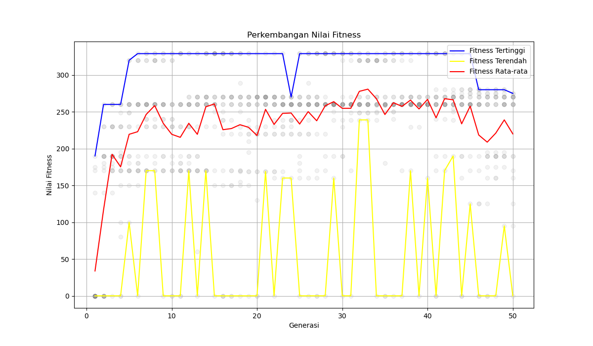

# Pertemuan 9 - Algoritma Genetika (Knapsack Problem)

**Nama:** Fauzan Malik Arkan 
**NIM:** H1D024036

## Deskripsi

Program ini mengimplementasikan **Algoritma Genetika (GA)** untuk menyelesaikan **Knapsack Problem** (masalah ransel). Tujuannya adalah memilih kombinasi barang yang menghasilkan **nilai total tertinggi** tanpa melebihi **kapasitas tas**.

## Data Barang

| No | Nama     | Nilai | Berat |
|----|----------|-------|-------|
| 1  | Barang 1 | 60    | 10    |
| 2  | Barang 2 | 100   | 20    |
| 3  | Barang 3 | 120   | 30    |
| 4  | Barang 4 | 90    | 25    |
| 5  | Barang 5 | 69    | 11    |
| 6  | Barang 6 | 70    | 9     |
| 7  | Barang 7 | 80    | 15    |
| 8  | Barang 8 | 90    | 10    |
| 9  | Barang 9 | 25    | 3     |

**Kapasitas Tas:** 50

## Parameter Algoritma Genetika

| Parameter          | Nilai |
|--------------------|-------|
| Jumlah Generasi    | 50    |
| Jumlah Populasi    | 20    |
| Probabilitas Crossover | 0.5 |
| Probabilitas Mutasi    | 0.1 |
| Kapasitas Tas      | 50    |

## Penjelasan Modul

### 1. `InisiasiPopulasi.py`
Membuat populasi awal secara acak. Setiap individu direpresentasikan sebagai **kromosom biner** (list of 0 dan 1), di mana:
- `1` = barang dipilih
- `0` = barang tidak dipilih

### 2. `EvaluasiFitness.py`
Menghitung nilai fitness setiap individu berdasarkan **total nilai barang yang dipilih**. Jika total berat melebihi kapasitas tas, fitness bernilai **0** (penalti).

### 3. `selection.py`
Menyediakan dua metode seleksi parent:
- **Roulette Wheel Selection** — Seleksi berdasarkan probabilitas proporsional terhadap fitness.
- **Tournament Selection** — Memilih individu terbaik dari sejumlah peserta yang dipilih secara acak.

### 4. `crossover.py`
Menyediakan tiga metode crossover:
- **One-Point Crossover** — Memotong kromosom di satu titik dan menukar segmen.
- **Two-Point Crossover** — Memotong kromosom di dua titik dan menukar segmen tengah.
- **Uniform Crossover** — Menggunakan mask acak untuk menentukan gen mana yang ditukar.

### 5. `mutation.py`
Menyediakan tiga metode mutasi:
- **Swap Mutation** — Menukar posisi dua gen secara acak.
- **Inversion Mutation** — Membalikkan urutan substring gen.
- **Uniform Mutation (Bit-Flip)** — Membalikkan nilai bit (0→1, 1→0) dengan probabilitas tertentu.

### 6. `main.py`
Program utama yang mengintegrasikan semua modul di atas untuk menjalankan proses evolusi Algoritma Genetika:
1. Inisialisasi populasi awal
2. Evaluasi fitness
3. Seleksi parent (Roulette Wheel)
4. Crossover (One-Point)
5. Mutasi (Swap)
6. Ulangi selama jumlah generasi yang ditentukan
7. Menampilkan grafik perkembangan fitness dan hasil terbaik

## Cara Menjalankan

```bash
python main.py
```

Setiap modul juga dapat dijalankan secara mandiri untuk testing:

```bash
python InisiasiPopulasi.py
python EvaluasiFitness.py
python selection.py
python crossover.py
python mutation.py
```

## Output

### Grafik Perkembangan Fitness



Grafik menampilkan:
- 🔵 **Biru** — Fitness Tertinggi per generasi
- 🔴 **Merah** — Fitness Rata-rata per generasi
- 🟡 **Kuning** — Fitness Terendah per generasi
- ⚫ **Abu-abu** — Sebaran fitness seluruh individu

### Contoh Hasil

```
Grafik disimpan sebagai output/fitness_history.png
Nilai Fitness Terbaik: 329
Total Bobot: 50
Barang Terpilih:
- Barang 2
- Barang 5
- Barang 6
- Barang 8
```

## Dependensi

- Python 3.x
- `matplotlib` — untuk visualisasi grafik
- `numpy` — untuk komputasi numerik

Install dependensi:

```bash
pip install matplotlib numpy
```
